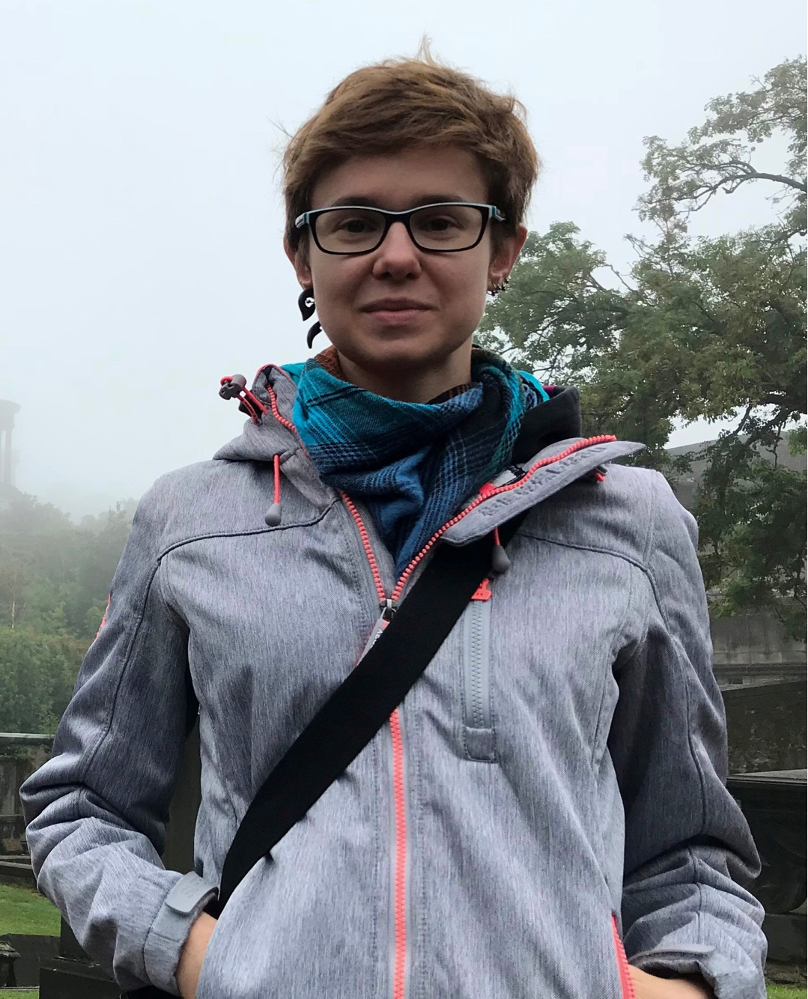

## Anna Parlak

I am a Krener Assistant Professor at the University of California Davis. 

My research revolves around __low-dimensional manifolds__.

You can get in contact with me via 

[My departmental profile](https://www.math.ucdavis.edu/people/general-profile?fac_id=aparlak)

&nbsp;

Before coming to UC Davis I was a Postdoctoral Research Associate at the University of Oxford (2021 - 2022), a PhD student at the University of Warwick (2017 - 2021), and a MSc (2015 - 2017) and a BSc (2012 - 2015) student at the University of Gdańsk. I also have a BSc in biotechnology.

[My CV](files/Parlak_CV_2022_AmE.pdf)
&nbsp;

### Research interests

* low-dimensional topology
* polynomial invariants of 3-manifolds 
* pseudo-Anosov flows
* veering triangulations
* mapping class groups

### Papers and preprints

1. _The taut polynomial and the Alexander polynomial_
 
    [arXiv:2101.12162](https://arxiv.org/abs/2101.12162v2)

2. _Computation of the taut, the veering and the Teichmüller polynomials_

    [Exp Math DOI: 10.1080/10586458.2021.1985656 (2021)](https://www.tandfonline.com/doi/full/10.1080/10586458.2021.1985656), [arXiv:2009.13558](https://arxiv.org/abs/2009.13558v2)

3. _Roots of Dehn twists on nonorientable surfaces_ (with Michał Stukow)

    [J Knot Theor Ramif,  Vol. 28, No. 12, 1950077 (2019)](https://www.worldscientific.com/doi/10.1142/S0218216519500779), [arXiv:1701.00531](https://arxiv.org/abs/1701.00531v2)

4. _Roots of crosscap slides and crosscap transpositions_ (with Michał Stukow)
 
    [Period Math Hung (2017) Vol. 75, Issue 2, pp. 413 – 419](https://link.springer.com/article/10.1007/s10998-017-0210-3), [arXiv:1601.06096](https://arxiv.org/abs/1601.06096v2)

### Software

[Veering](https://github.com/henryseg/Veering) (with Saul Schleimer and Henry Segerman)

code for studying taut and veering ideal triangulations

