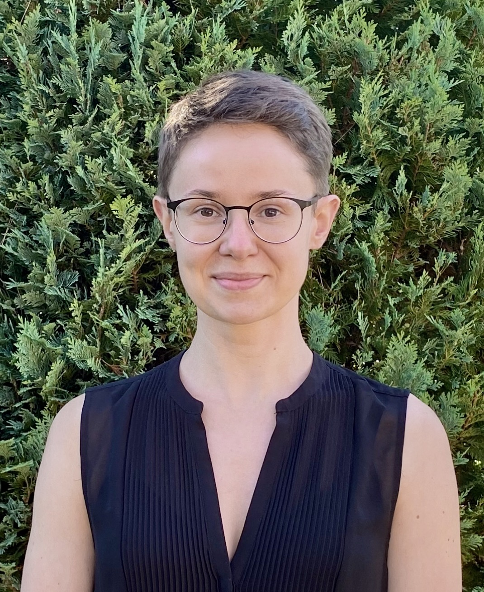

## Anna Parlak

I am leading the [Low-Dimensional Topology](https://www.mis.mpg.de/low-dimensional-topology) group at the Max Planck Institute for Mathematics in the Sciences in Leipzig, Germany. 

I work mainly on problems involving __3-manifolds__, __veering triangulations__, and __pseudo-Anosov flows__.

You can get in contact with me at   

&nbsp; 

✦ ✦ ✦

&nbsp; 

Before coming to MPI MiS, I was 
 - Krener Assistant Professor at the University of California, Davis (2022 - 2025)
 
 - Postdoctoral Research Associate at the University of Oxford (2021 - 2022)
 
 - PhD student at the University of Warwick (2017 - 2021)
 
 - MSc (2015 - 2017) and BSc (2012 - 2015) student at the University of Gdańsk 

Besides mathematics, I also have a BSc in biotechnology (2010 - 2013). 

You can download my academic CV here: [Parlak/CV](files/Parlak_CV_Apr2026_AmE.pdf)

<!--
---

### PhD positions at MPI MiS

The International Max Planck Research School has open positions for PhD students to carry out their thesis under the guidance of its scientific members. You may indicate me as your preferred mentor in your application.

The next application deadline is __May 1, 2026__.

Further details on how to apply can be found here: [PhD Call 2026](https://www.mis.mpg.de/career/imprs/apply)

 -->

<!--
### Upcoming talks

* March 4, 2025: Geometry & Topology Seminar @ Yale University

* January 21 - 23, 2026 @ [Pathways Workshop, Simons Laufer Mathematical Sciences Institute](https://www.slmath.org/workshops/1124)

* March 23 - 27, 2026 @ [Recent Progress in Topological and Geometric Structures in Low Dimensions](https://www.slmath.org/workshops/1141)-->

