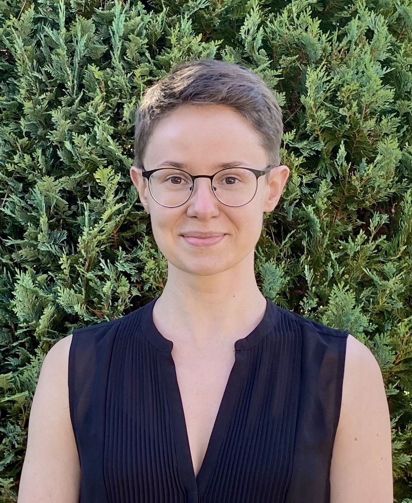
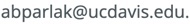

## Anna Parlak

I am a Krener Assistant Professor at the Department of Mathematics of the University of California in Davis. 

My research revolves around __low-dimensional manifolds__.

You can get in contact with me at 

[My departmental profile](https://www.math.ucdavis.edu/people/general-profile?fac_id=aparlak)

&nbsp;

Before coming to UC Davis I was a Postdoctoral Research Associate at the University of Oxford (2021 - 2022), a PhD student at the University of Warwick (2017 - 2021), and a MSc (2015 - 2017) and a BSc (2012 - 2015) student at the University of Gdańsk. Besides mathematics, I also have a BSc in biotechnology.

[My CV](files/Parlak_CV_March2024_AmE.pdf)

### Upcoming talks

* September 6th, 2024: [CIRGET Seminar, Université du Québec à Montréal](https://www.cirget.uqam.ca/en/seminars.html)

* September 9th - 13th, 2024: Sequence of talks at Queens University

* September 13th, 2024: [Department Colloquium at Queens University](https://www.queensu.ca/mathstat/seminars/colloquium)

